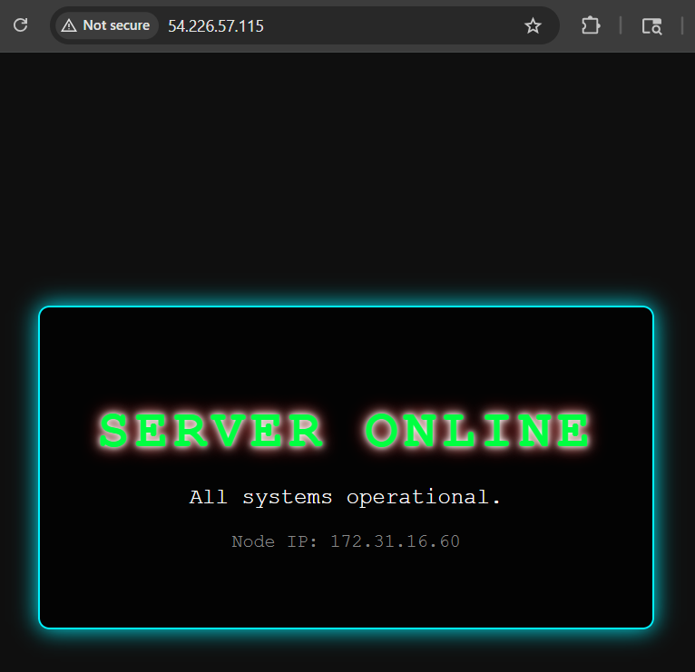
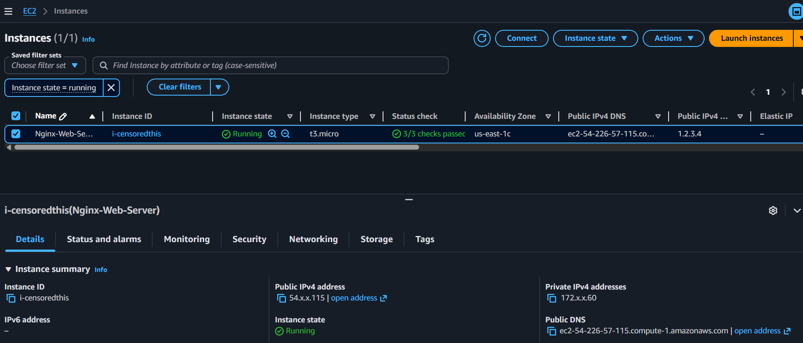
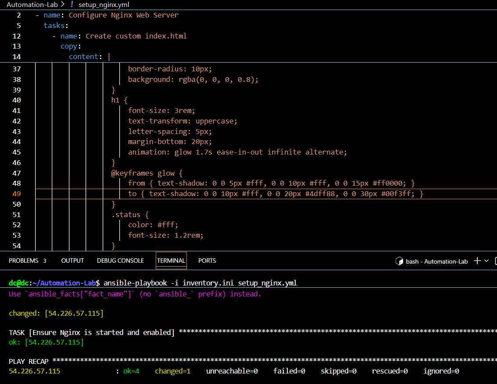

# Dual-Stack Engineering Portfolio: NetDevOps & Cloud Automation

Welcome to my technical lab repository. This project showcases a progression from core networking infrastructure into scalable Cloud Automation and Site Reliability Engineering (SRE) methodologies.

---

## Project 1: AWS Automated Web Infrastructure (SRE Lab)
**Directory:** [/AWS-Automation-Lab](./AWS-Automation-Lab)

A fully automated, immutable infrastructure deployment utilizing a unified Linux workflow to provision and configure cloud resources.

### Project Showcase
| System Online (Live Landing Page) | AWS Infrastructure Status |
|---|---|
|  |  |

> **Automation Deployment Loop:**
> 

### Core Capabilities Demonstrated:
* **Infrastructure as Code (IaC):** Utilized Terraform to provision AWS EC2 instances, custom security groups, and key pairs entirely from a WSL2 (Ubuntu) environment.
* **Configuration Management:** Deployed Ansible playbooks to automate Nginx web server installation and dynamically inject server metadata into a neon-styled HTML/CSS landing page.
* **State Recovery & Management:** Successfully handled a local environment migration by executing a `terraform import` to safely re-sync state configurations with running AWS assets, preventing resource drift or double-billing.
* **Security & Automation:** Resolved automated SSH handshake bottlenecks by configuring host-key bypass policies (`ANSIBLE_HOST_KEY_CHECKING=False`).

---

## Project 2: Comprehensive CCNA Network Lab Challenge
**Directory Root:** Active root sub-directories (/Day-1 through /Day-6)

A deep dive into Cisco Enterprise Networking principles, walking through configuration topology changes, routing protocol optimizations, and troubleshooting scenarios.

### Networking Skills Demonstrated:
* **Routing & Switching:** Implementing VLAN segmentation, Inter-VLAN routing, Router-on-a-Stick, and EtherChannel bundling.
* **Dynamic Routing Protocols:** Configuring and optimizing single-area and multi-area OSPF, EIGRP, and static routing failovers.
* **Network Security & Services:** Hardening device access via SSH/VTY, building Access Control Lists (ACLs), and deploying DHCP/NAT services.
